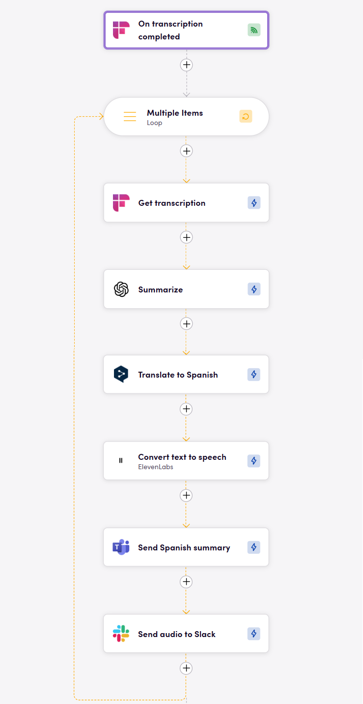

# Blackbird.io Fireflies.ai

Blackbird is the new automation backbone for the language technology industry. Blackbird provides enterprise-scale automation and orchestration with a simple no-code/low-code platform. Blackbird enables ambitious organizations to identify, vet and automate as many processes as possible. Not just localization workflows, but any business and IT process. This repository represents an application that is deployable on Blackbird and usable inside the workflow editor.

## Introduction

<!-- begin docs -->

Fireflies.ai makes it seamless to capture voice conversations. This app allows you to retrieve exactly the data you need in a structured format and use it in your workflows. You can automate tasks such as summarizing meeting notes, translating them, and distributing them across various platforms.

## Before setting up

- Log in to your account at [app.fireflies.ai](https://app.fireflies.ai/).
- Open [Settings](https://app.fireflies.ai/settings) from the left sidebar.
- Navigate to [Fireflies API](https://app.fireflies.ai/settings#DeveloperSettings) section.
- Copy your API key.

## Connecting

1. Navigate to apps and search for Fireflies.
2. Click _Add Connection_.
3. Name your connection for future reference e.g. 'My Fireflies'.
4. Fill in the 'API token' obtained earlier.
5. Click _Connect_.

## Actions

### Transcription

- **Get Transcription** Returns call general information, full transcription, and detailed sentence data.

### Events

- **On transcription completed** Starts a flight when transcription is competed. It has optional inputs to filter out desired transcriptions.

## Examples

The workflow depicted in the image above is triggered when a meeting transcription is completed. It then automatically retrieves the meeting dialog, summarizes it using an LLM, translates the summary into Spanish, converts it into audio, and distributes the Spanish summary through Microsoft Teams and the audio file via Slack.

## Feedback

Do you want to use this app or do you have feedback on our implementation? Reach out to us using the [established channels](https://www.blackbird.io/) or create an issue.

<!-- end docs -->
